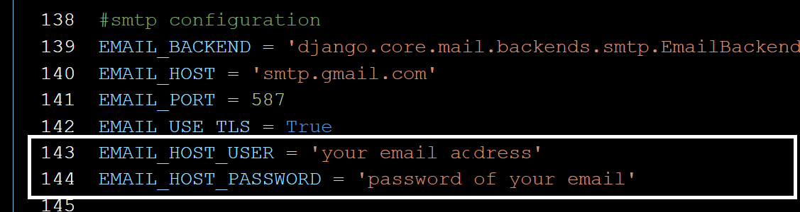

# Simple E-commerce web application
This project is a simple web application using python's framework django. Only the logged in user can place the order of the product.

There are 2 groups of the user, Admin and Customer.
- Admin can manage the backend portion of the application like :
1. Add tags
2. Add Products 
3. Can update the status (pending , Delivered, Out of Stoke) of the ordered product
4. Can view the orders of individual costumer as well as all costumers.

- While Customer can place the order and delete and view the details of placed orders by self.

## Installation

To run this code you would need:

1. Download/ Clone the project

```git
  git clone https://github.com/saras108/django_ecom
```

2. Get into directory
```cd
cd django_ecom
```

3. Create a virtual environment

```python3
  python3 -m venv env
```

4. Activate the environment
```env
  source env/bin/activate (for linux)
  .\env\Scripts\activate (for window)
```

5. Install the required packages

```python3
  pip3 install -r requirements.txt
``` 


6. Get inside the system directory
```cd
  cd ./learn
```


7. To run migrations.
```python
  python manage.py makemigrations
  python manage.py migrate
``` 

8. To create super_user run.
```
python manage.py createsuperuser
```
After running this command it will ask for username, email and password.


9. To run the server
```python3
python manage.py runserver
```

9.1. For Admin:
 ```
 localhost:8000/admin/
 ```
Enter the credentials which you have entered while creating the superuser.

After logged in as a Admin, do the following:

9.1.1. Add the group named 'admin' and 'customer' from admin panal and assign the role of admin to the superuser.


https://user-images.githubusercontent.com/44153868/148657387-7c508f3f-5958-4b4a-9718-0dee20075898.mp4


9.1.2. To give the service of forget password and password reset service via email, you have to go to <b>learn/learn/settings.py </b> and update your email and password manually (line  143 and 144 )





Then,

9.2. For Customer:


9.2.1. To Register as customer (Required only one time for each customer):
 ```
 localhost:8000/register/
 ```
 

9.2.2. To login as customer:
 ```
 localhost:8000/login/
 ```
Enter the credentials which you have entered while registering.

### Enjoy The System, THANK YOU :hugs: :hugs:
